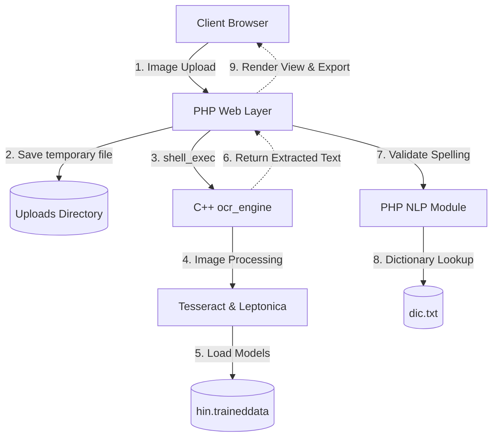

# Hindi OCR & NLP Engine


https://github.com/user-attachments/assets/c9359941-dc02-4768-8074-80f671f3dd03


A robust, production-ready web application for Optical Character Recognition (OCR) tailored specifically for Hindi text. This project integrates a fast C++ processing engine with Tesseract, coupled with a premium, accessible PHP-based UI that performs advanced NLP analysis on the extracted text.

## 🏗️ Architecture



## 🌟 Key Features

- **C++ OCR Engine**: Wraps Tesseract to provide fast image processing and exact text extraction.
- **Advanced Spell-Checking**: Employs phonetic algorithms including Levenshtein, Jaro-Winkler, Hamming Distance, and Longest Common Subsequence (LCS) for unmatched typo-correction.
- **Large-Scale Dictionary Validation**: Compares extracted Hindi text against a massive dictionary (`dic.txt`) to dynamically highlight out-of-vocabulary (OOV) tokens.
- **Document Export**: One-click generation and download of Microsoft Word `.doc` files containing the extracted text.
- **Modern, Accessible UI**: A highly polished, WCAG-compliant interface featuring drag-and-drop uploads, glassmorphism design, and micro-animations.

## 🚀 Getting Started

### Prerequisites

Ensure your system has the following installed:
- PHP 8.x with `mbstring`, `intl`, and `fileinfo` extensions enabled.
- Tesseract OCR (`libtesseract-dev`).
- Leptonica development libraries (`libleptonica-dev`).
- C++ Compiler (GCC/Clang) and Make.
- Hindi trained data available at `tesseract/tessdata/hin.traineddata`.

### Build the Compute Engine

Navigate to the project directory and build the C++ `ocr_engine`:

```bash
make build
```

Run the built-in test suite to verify the binaries and lint the PHP files:

```bash
make test
```

### Start the Application

You can start the local development server:

```bash
make run
```
Or simply use:
```bash
php -S 127.0.0.1:8080
```
Then navigate to `http://127.0.0.1:8080/` in your browser.

## 🛡️ Security Notes

- **Upload Validation**: File sizes are strictly limited to 10MB. Allowed MIME types are PNG, JPG, WEBP, TIFF, and BMP.
- **Ephemeral Storage**: Uploaded files use securely randomized names and are immediately unlinked (deleted) after OCR processing.
- **Directory Protection**: The `uploads/` directory contains an `.htaccess` file denying direct Apache access, mitigating reverse shell risks.

## 💻 CLI Usage

You can bypass the UI and use the engine directly from the command line:

```bash
./ocr_engine ocr path/to/image.png
```

The output will include the raw extracted Hindi text followed by a `#####STATS#####` block containing computational metrics utilized by the PHP frontend.
